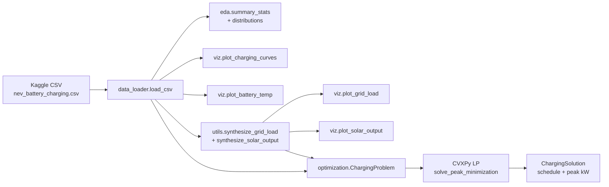

# ev-charging-opt

> Open-source EV smart-charging simulator, data viz, and grid-congestion optimization stub.

[](https://github.com/akashladha/ev-charging-opt/actions)
[](https://www.python.org/)
[](https://opensource.org/licenses/MIT)

---

## Problem statement

EV charging demand is rising faster than grid capacity. The climate benefit of
EV adoption is eroded by local grid congestion at high-penetration nodes, and
the tooling to coordinate charging across utilities, OEMs, and charge-point
operators is fragmented:

- **Protocol fragmentation.** OCPP (charger ↔ network) and ISO 15118 (vehicle ↔
  charger) live in different stacks; few open tools speak both.
- **Forecast + control + hardware loop.** Real-time optimization needs all three
  and most open-source projects only provide one.
- **Production gap.** Reinforcement-learning microgrid papers exist, but
  shipping artifacts are rare.

`ev-charging-opt` is a beginner-friendly scaffold that loads real EV battery
telemetry, visualizes the charging curves and (synthetic) grid context, and
provides a CVXPy peak-load-minimization stub you can extend toward production.

---

## Architecture



ASCII fallback:

```
   CSV ─► data_loader ─► eda ─► distributions.png
              │                  correlation.png
              ├─► viz ─► charging_curves.png
              │           battery_temp.png
              ├─► utils (synth grid + solar)
              │           ├─► viz.plot_grid_load   ─► grid_load.html
              │           └─► viz.plot_solar_output ─► solar_output.png
              └─► optimization.ChargingProblem
                          └─► CVXPy ─► ChargingSolution
```

---

## How to run

### 1. Clone and create a virtual environment

```bash
git clone https://github.com/akashladha/ev-charging-opt.git
cd ev-charging-opt
python -m venv .venv
source .venv/bin/activate          # Windows: .venv\Scripts\activate
pip install -r requirements.txt
```

Or with Poetry:

```bash
poetry install
poetry shell
```

### 2. Put your CSV in `data/`

Download the [Kaggle NEV battery charging dataset](https://www.kaggle.com)
(or any CSV with the same schema) and save it as
`data/nev_battery_charging.csv`.

Expected columns:

```
timestamp, SOC, SOH, terminal_voltage, battery_current,
battery_temp, ambient_temp, internal_resistance, ...
```

### 3. Run the demo

```bash
python -m src --csv data/nev_battery_charging.csv --out outputs/
```

You'll get:

- `outputs/summary_stats.csv` — per-column descriptive statistics
- `outputs/distributions.png` — histograms of SOC / SOH / voltage / temp
- `outputs/correlation.png` — Pearson correlation heatmap
- `outputs/charging_curves.png` — SOC + terminal voltage vs time
- `outputs/battery_temp.png` — battery vs ambient temperature with thresholds
- `outputs/solar_output.png` — synthetic PV profile
- `outputs/grid_load.html` — interactive Plotly stacked-area grid plot

And a console report:

```
naive peak: 137.4 kW
optimized peak (optimal): 92.1 kW
reduction: 33.0%
```

### 4. Run tests

```bash
pytest -v
```

### 5. Lint / format

```bash
black src tests
flake8 src tests --max-line-length=100
```

---

## Sample outputs

| Plot | What it shows |
|------|---------------|
| `charging_curves.png` | SOC and terminal voltage overlay with green/red lines at each charge-segment start/stop |
| `grid_load.html` | Stacked base + EV load with optional solar subtraction; interactive (Plotly) |
| `solar_output.png` | Bell-curve PV generation profile |
| `battery_temp.png` | Battery temp vs ambient, with warn (45°C) and critical (60°C) bands |
| `distributions.png` | Histograms with KDE overlays for the main telemetry channels |

> The CSV does **not** include grid load or PV output. Those signals are
> synthesized in `utils.synthesize_grid_load` and `synthesize_solar_output`
> so the viz functions have something realistic to plot. Replace them with
> real OCPP / utility telemetry once available.

---

## Roadmap

- [ ] **OCPP log parser** — convert OCPP 1.6/2.0.1 JSON traces into the
      schema this project expects.
- [ ] **ISO 15118 SECC stub** — minimal Plug & Charge handshake mock.
- [ ] **Forecasting module** — short-horizon (15 min – 24 h) base-load and
      solar forecasters (Prophet / LightGBM / linear baseline).
- [ ] **RL agent** — PPO baseline in `optimization/rl_agent.py` for
      comparison against the LP solver.
- [ ] **Multi-tariff objective** — minimize cost under time-of-use pricing
      instead of (or alongside) peak.
- [ ] **Grid-congestion forecaster** — predict transformer-level overload
      from historical neighborhood load.
- [ ] **Dockerfile + devcontainer** — one-command repro.

---

## Contribution guidelines

Contributions welcome — this is built to be hacked on.

1. **Open an issue first** for anything beyond a typo fix.
2. **Branch from `main`**: `git checkout -b feat/your-feature`.
3. **Keep changes small.** One concern per PR.
4. **Run the quality gates** before pushing:
   ```bash
   black src tests
   flake8 src tests --max-line-length=100
   pytest -v
   ```
5. **Write tests** for new logic in `tests/`. Aim for one positive case and
   one failure-mode case.
6. **Update the README and docstrings** if you change a public function.
7. **PR template:** what / why / how-tested.

Good first issues are tagged `good first issue` in the GitHub issue tracker.

---

## License

MIT — see [`LICENSE`](LICENSE).
